<p align="center">
  
</p>

<p align="center">
  
</p>

<h1 align="center">Terminus</h1>

<p align="center">
  <strong>The terminal that learns how you work.</strong>
</p>

<p align="center">
  A next-generation macOS terminal built in Swift + SwiftUI.<br/>
  Zero dependencies. Native performance. AI-powered intelligence.
</p>

<p align="center">
  <a href="https://github.com/Worth-Doing/terminus/releases/latest/download/Terminus-0.2.0.dmg">
    
  </a>
</p>

<p align="center">
  
  
  
  
  
</p>

---

## Download

**[Download Terminus-0.2.0.dmg](https://github.com/Worth-Doing/terminus/releases/latest/download/Terminus-0.2.0.dmg)** (4.4 MB)

> Signed and notarized by Apple. Runs on macOS 14+ (Sonoma and later), Apple Silicon & Intel.
>
> Open the DMG and drag `Terminus.app` to Applications.

---

## What is Terminus?

Terminus is a **native macOS terminal** that combines traditional shell power with smart command intelligence:

- **Real terminal emulator** — VT100/xterm compatible, true color, alternate screen buffer
- **Multi-panel workspace** — Split horizontally/vertically, tabs, spatial keyboard navigation
- **Learning-based predictions** — Learns your command patterns, suggests continuations based on frequency, recency, directory, and project context
- **Saved commands** — Save, tag, and parameterize complex commands for reuse
- **System monitor** — Live CPU, RAM, GPU, disk, and network metrics in a side panel
- **Semantic search** — Search your command history by meaning, powered by OpenRouter embeddings
- **AI assistance** — Optional command explanation, natural language to shell, powered by OpenRouter
- **Command palette** — Fuzzy-searchable launcher for every action (`Cmd+Shift+P`)

This is not a chatbot stuffed into a terminal. The terminal works fully offline — AI is an optional enhancement layer.

---

## Screenshots

### Terminal + System Monitor
```
┌──────────────────────────────────────────────────────────┬────────────┐
│ $ git status                                             │ CPU  23.4% │
│ On branch main                                           │ ████░░░░░░ │
│ Changes not staged for commit:                           │            │
│   modified:   src/app.ts                                 │ RAM  67.2% │
│                                                          │ ██████░░░░ │
│ $ _                                                      │            │
│                                                          │ GPU  12%   │
│                                                          │ NET  ↓2.1  │
│──────────────────────────────────────────────────────────│      ↑0.3  │
│ ~/projects/myapp                           0  120x40     │            │
└──────────────────────────────────────────────────────────┴────────────┘
```

---

## Features

### Terminal Core
- PTY via `forkpty()` with full process lifecycle management
- VT100/xterm escape sequence parser (CSI, SGR, OSC, DCS)
- 256-color and 24-bit true color support
- Alternate screen buffer (vim, less, htop)
- Scrollback buffer (configurable, default 10,000 lines)
- Mouse selection, copy/paste, word selection (double-click)
- Bracketed paste mode

### Multi-Panel Workspace
- Split horizontally (`Cmd+D`) or vertically (`Cmd+Shift+D`)
- Draggable dividers with minimum size enforcement
- Spatial focus navigation (`Cmd+Option+Arrow`)
- Multiple tabs with independent workspaces
- Double-click divider to reset 50/50

### Smart Predictions
- Multi-signal scoring: frequency, recency, prefix match, directory context, project type, n-gram sequences, feedback loop
- Project type detection via marker files (package.json, Cargo.toml, Package.swift, go.mod, etc.)
- Git branch awareness
- Works 100% offline — no AI required

### System Monitor (`Cmd+Shift+M`)
- Real-time CPU usage with per-core data and sparkline history
- RAM usage: active, wired, compressed, swap, pressure gauge
- GPU utilization via IOKit (Apple Silicon + discrete)
- Disk usage and network throughput (download/upload)
- Top 8 processes by memory consumption
- 1.5s refresh interval

### Saved Commands
- Save any command with a name, description, and tags
- Template parameters: `deploy {{environment}} --tag {{version}}`
- Tag-based filtering in sidebar
- Quick insert from command palette or sidebar

### AI Features (Optional, via OpenRouter)
- Semantic search over command history using embeddings
- Command explanation
- Natural language to shell command
- API key stored in macOS Keychain
- Models configurable (default: Claude Sonnet for chat, text-embedding-3-small for embeddings)

### Appearance & Theming
- 6 built-in themes with light & dark variants:
  - **Light:** Terminus Light (default), Solarized Light
  - **Dark:** Terminus Dark, Solarized Dark, Dracula, Nord
- Adaptive UI chrome — toolbar, sidebar, panels, overlays all follow the active theme
- Automatic macOS appearance integration (light/dark mode via `preferredColorScheme`)
- Theme switching via Settings or Command Palette
- Font picker: SF Mono, Menlo, JetBrains Mono, Fira Code, and more
- Font size slider (10pt — 28pt)
- Window opacity control
- Cursor style: block, underline, bar (with blink)
- Accent color presets
- Settings persist across sessions (UserDefaults)

---

## Keyboard Shortcuts

| Action | Shortcut |
|--------|----------|
| Split Horizontally | `Cmd + D` |
| Split Vertically | `Cmd + Shift + D` |
| Close Panel | `Cmd + W` |
| New Tab | `Cmd + T` |
| Command Palette | `Cmd + Shift + P` |
| Semantic Search | `Cmd + Shift + F` |
| System Monitor | `Cmd + Shift + M` |
| Toggle Sidebar | `Cmd + B` |
| Focus Next Panel | `Cmd + Shift + ]` |
| Focus Previous Panel | `Cmd + Shift + [` |
| Focus Right/Left/Up/Down | `Cmd + Option + Arrow` |
| Copy | `Cmd + C` |
| Paste | `Cmd + V` |
| Select All | `Cmd + A` |
| Clear Terminal | `Cmd + K` |
| Settings | `Cmd + ,` |

---

## Architecture

**17 modules**, zero external dependencies. Everything uses system frameworks:

| Module | Purpose |
|--------|---------|
| `Terminus` | App entry point, main view, toolbar, tabs |
| `SharedModels` | All data types |
| `DataStore` | SQLite wrapper + schema |
| `SecureStorage` | Keychain wrapper |
| `SharedUI` | Theme system, design tokens, command palette |
| `TerminalCore` | PTY lifecycle (forkpty) |
| `TerminalEmulator` | VT100 parser + buffer + shell integration |
| `TerminalUI` | NSView rendering + input |
| `WorkspaceEngine` | Panel tree + splits + tabs |
| `HistoryEngine` | Command history |
| `PredictionEngine` | Smart suggestions + project detection |
| `SavedCommands` | Saved command CRUD + UI |
| `AIService` | OpenRouter client |
| `EmbeddingPipeline` | Vector search (Accelerate/vDSP) |
| `SystemMonitor` | Live CPU/RAM/GPU/disk/network metrics |
| `OnboardingUI` | First-run flow |
| `SettingsUI` | Preferences |

### System Frameworks Used
`Foundation` `SwiftUI` `AppKit` `CoreText` `Security` `SQLite3` `Accelerate` `IOKit` `Darwin`

---

## Build from Source

```bash
# Requirements: macOS 14+, Swift 6.0+

# Clone
git clone https://github.com/Worth-Doing/terminus.git
cd terminus

# Build and run (development)
swift build
swift run Terminus

# Run tests
DEVELOPER_DIR=/Applications/Xcode.app/Contents/Developer swift test

# Build unsigned .app bundle
./Scripts/bundle-app.sh

# Build signed .app bundle
./Scripts/bundle-app.sh --sign

# Build signed + Apple notarized
./Scripts/bundle-app.sh --notarize
```

---

## Project Stats

| Metric | Value |
|--------|-------|
| Swift files | 30 |
| Lines of code | ~9,600 |
| Modules | 17 |
| Themes | 6 (2 light, 4 dark) |
| External dependencies | 0 |
| Binary size | 3.4 MB |

---

## Roadmap

- [x] Mouse reporting (modes 1000, 1002, 1003)
- [x] Hyperlink support (OSC 8)
- [x] Glass UI redesign (iOS 26 aesthetic)
- [x] Full prediction engine (7-signal scoring)
- [x] N-gram command sequence learning
- [x] Performance optimization (dirty region tracking, render batching)
- [ ] Ligatures support (Fira Code, JetBrains Mono)
- [ ] Sixel image protocol
- [ ] tmux integration
- [ ] Plugin system
- [ ] Custom theme editor / theme import
- [ ] Command workflow automation
- [ ] iCloud sync for saved commands
- [ ] Session save/restore

---

## License

MIT License. See [LICENSE](LICENSE) for details.

---

<p align="center">
  Built with care by <a href="https://github.com/Worth-Doing">Worth-Doing</a>
</p>
